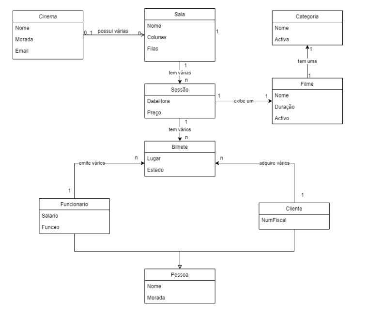

# Projeto de DA

O presente repositório contém o projeto de Desenvolvimento de Aplicações, realizado no âmbito da unidade curricular de Desenvolvimento de Aplicações, do TESP de PSI do Instituto Politécnico de Leiria pelos alunos:

- João Matos - 2220857
- João Fernandes
- Rúben Lisboa

## Descrição do Projeto

O projeto consiste numa aplicação Windows Forms para a gestão de um cinema. A aplicação permite a gestão de filmes, salas, sessões e bilhetes. Sendo possível a criação, edição e remoção de cada um dos elementos. Adicionalmente, é possivel criar novos clientes e funcionários, bem como editar os dados do cinema.

## Modelo de dados

